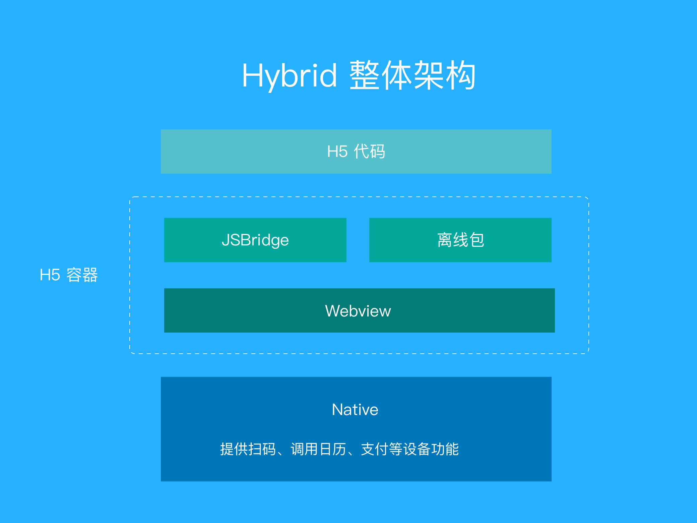

# mobile-web-best-practice-container

H5 容器

## Hybrid App 架构：



包含以下几个方面：

1. JS 通信及 API 设计

2. 离线包设计

#### 相关项目

H5 项目： [mobile-web-best-practice](https://github.com/mcuking/mobile-web-best-practice)

离线包管理平台：[offline-package-admin](https://github.com/mcuking/offline-package-admin)

离线包 webpack 插件：[offline-package-webpack-plugin](https://github.com/mcuking/offline-package-webpack-plugin)

## JS 通信及 API 设计

todo

## 离线包设计

原理如下图所示：


todo

## 已有功能

1. 集成 [DSBridge-Android](https://github.com/wendux/DSBridge-Android)

2. 向 h5 提供同步到本地日历功能，API 如下：

```ts
interface SyncCalendarParams {
  id: string; // 日程唯一标识符
  title: string; // 日程名称
  location: string; // 日程地址
  startTime: number; // 日程开始时间
  endTime: number; // 日程结束时间
  alarm: number[]; // 提前提醒时间，单位分钟
}

dsbridge.call('syncCalendar', params: SyncCalendarParams, cb);
```
